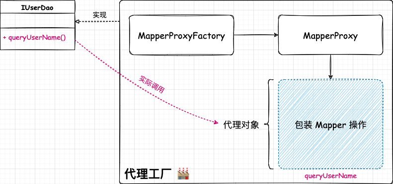
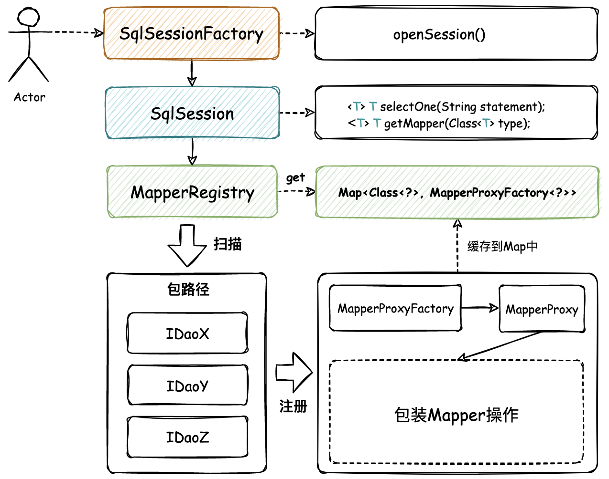
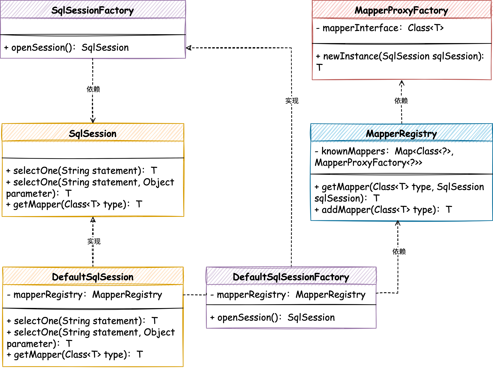

学习mybatis
## 一、创建简单的映射器代理工厂
1. MapperProxy：实现InvocationHandler接口，仅用于实现代理对象的方法。【包装对数据库的操作。】
2. MapperProxyFactory：工厂对象。
   1. 提供newInstance方法，用于为每个 IDAO 接口生成代理类。



## 二、实现映射器的注册和使用
1. MapperProxy：用于实现代理对象的调用方法。调用SqlSession中方法使用。
2. MapperProxyFactory：工厂对象，用于创建代理对象。
3. MapperRegistry：注册类，提供获取Mapper和注册Mapper的方法
   1. getMapper：获取接口对应的工厂类，然后调用newInstance创建代理对象。
   2. addMapper：注册代理工厂。
   3. addMappers：扫描对应的包，调用addMapper依次注册代理工厂。
4. SqlSession：提供sql底层实现方法
   1. DefaultSqlSession#selectOne：sql底层实现方法
   2. DefaultSqlSession#getMapper：调用MapperRegistry#getMapper获取接口对应的工厂类。
5. SqlSessionFactory：开启session
   1. DefaultSqlSessionFactory#openSession：新建一个session
测试demo:
```java
public class ApiTest {

   private Logger logger = LoggerFactory.getLogger(ApiTest.class);

   @Test
   public void test_MapperProxyFactory() {
      // 1. 注册 Mapper
      MapperRegistry registry = new MapperRegistry();
      registry.addMappers("com.windranger.dao");

      // 2. 从 SqlSession 工厂获取 Session
      SqlSessionFactory sqlSessionFactory = new DefaultSqlSessionFactory(registry);
      SqlSession sqlSession = sqlSessionFactory.openSession();

      // 3. 获取映射器对象
      IUserDao userDao = sqlSession.getMapper(IUserDao.class);

      // 4. 测试验证
      String res = userDao.queryUserName("10001");
      logger.info("测试结果：{}", res);
   }

}
```

